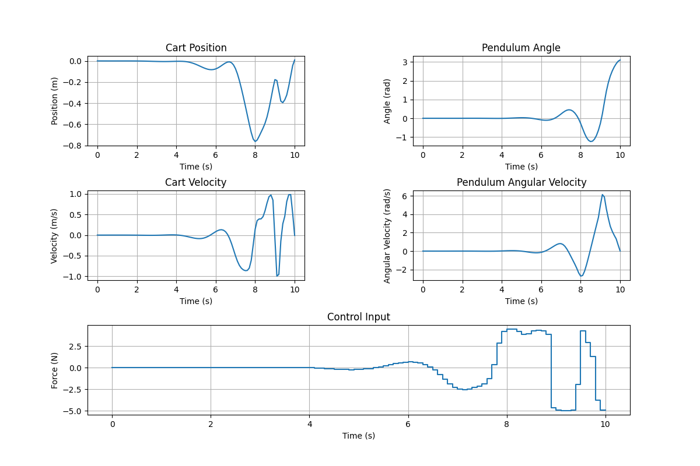
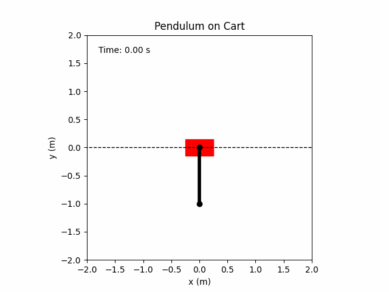

# ILQR

The Iterative Linear Quadratic Regulator (ILQR) is a control algorithm designed to optimize nonlinear systems. This project implements the ILQR algorithm for various applications, providing a robust and efficient method for trajectory optimization. 

There are couple advantages to use this package:
- Pure C++ implementation
- Only depends on Eigen (Gtest is optional for testing)
- Easy dependency control using vcpkg
- High perfomance since ther is no dynamic memory allocations (templated)
- Provides discritization with different integration steppers
- Provides numerical differantiation for continuous/discrete system and the cost function

## Requirements

Before installing ILQR, ensure you meet the following system requirements:

- Git
- CMake
- A build system such as Make or Ninja
- A C++ compiler like g++ or clang
- Optional: Matplotlib, Pandas, and Pillow for visualization

## Installation

Follow these steps to install ILQR:

1. Clone the repository:
    ```bash
    git clone https://github.com/HalukErdogan/ilqr.git
    ```

2. Navigate to the repository directory:
    ```bash
    cd ilqr
    ```

3. Initilize the submodule
    ```bash
    git submodule init
    ```
4. Update the submodule
    ```bash
    git submodule update
    ```

5. Configure the package:
    ```bash
    cmake --preset default
    ```

6. Build the package:
 
    ```bash
   cmake --build --preset default
    ```

## Example

An example that demonstrates how to solve a trajectory optimization problem for a pendulum on a cart is given in the "example" folder. This problem is solved about 0.004 secs. Follow the steps provided below to execute the example:

1. Run the executable:

    For Windows:
    ```bash
    ./build/examples/pendulum_on_cart/Release/pendulum_on_cart.exe
    ```
    For Linux:
    ```bash
    ./build/examples/pendulum_on_cart/pendulum_on_cart
    ```
2. Visualize the results:
    ```bash
    python3 ./examples/pendulum_on_cart/scripts/visualize.py
    ```
   Result:

   

3. Animate the results:
    ```bash
    python3 ./examples/pendulum_on_cart/scripts/animate.py
    ```
   
   Result:

   


## Roadmap

- [x] Add continuous system base class
- [x] Add discrete system base class
- [x] Add cost function base class
- [x] Add continuous system with finite diff class
- [x] Add discrete system with finite diff class
- [x] Add cost function with finite diff class
- [x] Add test for finite diff classes
- [x] Add Euler integration stepper
- [x] Add second order Runge - Kutta integration stepper
- [x] Add third order Runge - Kutta integration stepper
- [x] Add fourth order Runge - Kutta integration stepper
- [x] Add constant integration iterator
- [x] Add discritizer class
- [x] Add quadratic cost function
- [x] Add ilqr class
- [x] Add line search
- [x] Add example: pendulum on cart
- [x] Add scripts to visualize and animate the result of example
- [ ] Add inequality constrains using control barrier functions
- [ ] Add adaptive itegration iterator

## Contact

Author: Haluk Erdogan

Email: haluk_erdogan@outlook.com

Linkedin: [haluk_erdogan](https://www.linkedin.com/in/halukerdogan/)
